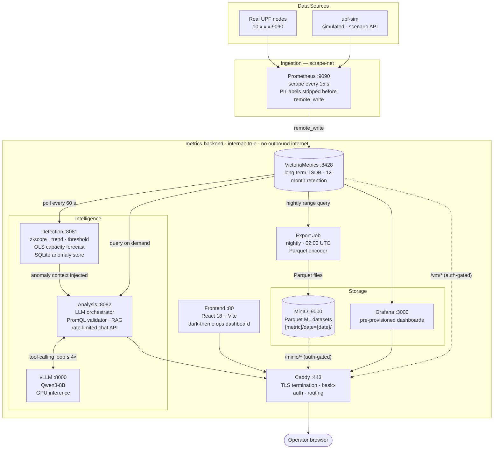

# BESS-UPF AI

Intelligent monitoring and analysis platform for 5G User Plane Functions.
Collects metrics from UPF nodes, runs real-time anomaly detection, generates capacity forecasts, and exposes a conversational LLM interface for operators and management.

---

## Architecture



> All backend services run on the `metrics-backend` Docker bridge (`internal: true`) — no outbound internet, unreachable from outside Docker except through Caddy on ports 80 / 443. Prometheus also joins `scrape-net` to reach physical UPF endpoints on the operator LAN.

---

## Services at a glance

| Service | Image / source | Role |
|---|---|---|
| `prometheus` | `prom/prometheus:v2.52.0` | Scrapes UPF exporters, remote-writes to VM |
| `victoriametrics` | `victoriametrics/victoria-metrics:v1.101.0` | Long-term TSDB |
| `export-job` | `./export-job/` (Go) | Nightly VM → Parquet → MinIO export |
| `minio` | `minio/minio` | Parquet object store (ML dataset output) |
| `upf-sim` | `./upf-sim/` (Go) | Simulated UPF — realistic 5G metrics + scenario API |
| `detection` | `./detection/` (Go) | Anomaly detection (z-score, trend, threshold, OLS forecast) |
| `analysis` | `./analysis/` (Go) | LLM orchestrator, PromQL validator, chat API |
| `vllm` | `vllm/vllm-openai:v0.7.3` | Qwen3-8B inference (GPU required) |
| `frontend` | `./frontend/` (React 18 + Vite) | Dark-theme ops dashboard |
| `grafana` | `grafana/grafana:11.0.0` | Pre-provisioned dashboards over VM |
| `caddy` | `caddy:2.8-alpine` | TLS termination, reverse proxy, basic-auth |

---

## Directory layout

```
.
├── docker-compose.yml
├── .env.example                      # copy to .env and fill in all CHANGE_ME values
│
├── config/
│   ├── prometheus/
│   │   ├── prometheus.yml            # scrape jobs + remote_write config + PII relabeling
│   │   └── targets/upf-targets.yml  # file_sd targets (hot-reloaded every 30 s)
│   ├── caddy/Caddyfile               # TLS termination + routing + security headers
│   ├── detection/rules.yml           # anomaly detection rules (restart detection to reload)
│   ├── export/crontab                # supercronic schedule (default: 02:00 UTC daily)
│   └── grafana/                      # provisioning (datasource + dashboard JSON)
│
├── scripts/
│   ├── gen-dev-certs.sh              # DEV ONLY — self-signed cert generator
│   └── minio-init.sh                 # creates bucket + least-privilege service account
│
├── upf-sim/                          # Simulated UPF (Go)
│   ├── internal/sim/                 # diurnal baseline + scenario engine
│   └── internal/api/                 # scenario control HTTP API
│
├── export-job/                       # Nightly export pipeline (Go)
│   └── internal/
│       ├── vmclient/                 # VictoriaMetrics range query client
│       ├── writer/                   # Parquet encoder (Apache Parquet via arrow)
│       ├── store/                    # MinIO ObjectStore + idempotency
│       └── job/                      # pipeline orchestrator
│
├── detection/                        # Anomaly detection service (Go)
│   └── internal/
│       ├── detector/                 # z-score, trend, threshold, OLS forecaster
│       ├── store/                    # SQLite anomaly event store
│       ├── notifier/                 # webhook dispatcher
│       └── vmclient/                 # VM query client
│
├── analysis/                         # LLM analysis service (Go)
│   ├── internal/
│   │   ├── api/                      # HTTP handler, rate limiter, basic-auth middleware
│   │   ├── llm/                      # Orchestrator: tool-calling loop over vLLM
│   │   ├── validator/                # PromQL safety validator + metric allowlist
│   │   ├── vmclient/                 # Instant + range query client
│   │   ├── detector/                 # Detection service client (anomaly proxy)
│   │   ├── simclient/                # Simulator scenario client
│   │   ├── rag/                      # Keyword retriever over analysis/docs/*.md
│   │   └── store/                    # SQLite audit log
│   └── docs/                         # Runbook markdown loaded into RAG context
│
├── frontend/                         # React 18 + Vite + TypeScript SPA
│   └── src/
│       ├── api/                      # All fetch() calls, typed response shapes
│       ├── features/                 # One folder per view (overview, anomalies, forecast, chat, scenario)
│       ├── components/               # Shared primitives (KpiCard, Badge, PulseStrip …)
│       ├── hooks/                    # Shared React Query hooks (useAnomalies …)
│       ├── store/                    # Zustand global state
│       └── lib/                      # Formatters, metric display names, constants
│
└── eval/                             # LLM chat quality eval harness (Go)
```

---

## Quick start

### Prerequisites

- Docker Desktop or Docker Engine + Compose v2
- NVIDIA GPU with ≥ 8 GB VRAM (for vLLM — see model sizing below if GPU is unavailable)
- `openssl` (for dev cert generation)

### First-time setup

```bash
# 1. Clone and enter the repo
git clone <repo-url> && cd Bess_Upf_AI

# 2. Create .env from template and fill in every CHANGE_ME value
cp .env.example .env
$EDITOR .env

# 3. Generate a Caddy bcrypt hash for CADDY_ADMIN_PASS_HASH
docker run --rm caddy:2.8-alpine caddy hash-password --plaintext 'your_admin_password'
# Copy the output into .env → CADDY_ADMIN_PASS_HASH

# 4. Generate dev TLS certificates (browser will show a warning — see TLS section)
bash scripts/gen-dev-certs.sh

# 5. Build and start everything
docker compose up --build -d

# 6. Check all services are healthy
docker compose ps
```

On first startup, vLLM downloads the model weights (~5 GB for Qwen3-8B INT4). Watch progress with `docker compose logs -f vllm`.

### Verify the stack

```bash
# Frontend (main entry point)
open https://localhost   # accept self-signed cert warning

# Analysis chat API
curl -k -u analyst:your_password https://localhost/api/v1/chat \
  -H "Content-Type: application/json" \
  -d '{"message": "What is the current session count?"}'

# Detection anomalies feed
curl -k -u analyst:your_password https://localhost/api/v1/anomalies

# VictoriaMetrics UI
open https://localhost/vm/

# MinIO console
open https://localhost/minio/

# Grafana dashboards
open https://localhost/grafana/

# Trigger an immediate export run (bypasses the 02:00 cron)
docker compose exec export-job /usr/local/bin/upf-exporter
```

---

## Data flow in detail

### 1 — Metric ingestion

```
UPF / upf-sim  →  Prometheus (scrape every 15 s)
                        │
                        └─ remote_write → VictoriaMetrics (long-term store, 12-month default)
```

Edit `config/prometheus/targets/upf-targets.yml` to add real UPF endpoints. Prometheus hot-reloads it every 30 seconds — no restart needed.

```yaml
- targets:
    - "10.0.1.10:9090"
  labels:
    upf_id: upf-east-1
    site:   east
    vendor: your-vendor
```

**PII policy:** `write_relabel_configs` in `prometheus.yml` drops `imsi`, `subscriber_*`, and `ue_ip` labels before they reach VictoriaMetrics. Never add subscriber-identifying labels; if you do, add a matching `labeldrop` rule and get security sign-off before narrowing any existing rule.

### 2 — Anomaly detection

The detection service polls VictoriaMetrics every 60 seconds using rules defined in `config/detection/rules.yml`:

| Rule | Algorithm | Fires when |
|---|---|---|
| `zscore` | Population z-score over rolling window | `\|z\| > threshold` |
| `trend` | OLS linear regression on window-minus-last | Last point deviates `> deviation_threshold` from predicted |
| `threshold` | Static bounds check | Latest value `< min` or `> max` |
| `forecast` (tier 3) | OLS trend extrapolation to a horizon | Predicted value `>= capacity` within `horizon` |

Events are stored in SQLite and exposed on `:8081/anomalies` (internal only).

To add or tune rules, edit `config/detection/rules.yml` and restart:

```bash
docker compose restart detection
docker compose logs -f detection   # watch for "detection pass complete"
```

### 3 — LLM analysis

The analysis service wraps vLLM in a tool-calling loop. When a chat message arrives:

1. Active anomaly events are injected as context.
2. The model generates PromQL tool calls; each is validated before reaching VM.
3. Query results are fed back to the model for up to 4 iterations.
4. The final answer, the PromQL queries used, and referenced anomalies are returned.

PromQL safety is enforced at five layers:

| Check | What it blocks |
|---|---|
| Syntax | Malformed PromQL (`parser.ParseExpr`) |
| Fan-out guard | Queries without a metric name (e.g. bare `{job="upf"}`) |
| Metric allowlist | Any metric not present in VM's live `__name__` index |
| Time-range cap | `time_range > MAX_QUERY_RANGE` (default 720 h) |
| Step floor | `step < MIN_STEP` (default 15 s) |

Validation errors are returned as tool results so the model can reformulate — they are not fatal.

### 4 — Parquet export (ML dataset)

The export job runs nightly at 02:00 UTC (configurable via `config/export/crontab`). For each metric in `EXPORT_METRICS`:

1. Queries VM for the past 24 h at 15 s resolution.
2. Encodes to Parquet with schema `{timestamp_unix_ms, value, labels…}`.
3. Uploads to MinIO at `{bucket}/{metric}/date={YYYY-MM-DD}/{date}.parquet`.
4. Writes a `.done` sentinel file for idempotency — re-runs skip already-exported dates.

---

## Frontend views

| View | Audience | What it shows |
|---|---|---|
| **Overview** | Management + NOC | 4 live KPI cards · recent anomaly feed · active forecasts · system health strip |
| **Anomaly Feed** | NOC | Full event table, filterable by severity and type (live / forecast) |
| **Forecast** | NOC + management | Per-metric trend cards with OLS projection and ETA to capacity |
| **Chat** | All | Conversational LLM interface with reasoning trail and suggested prompts |
| **Scenario Control** | Dev / demo | Activate traffic scenarios on upf-sim (hidden in production via env var) |

The live **Pulse Strip** at the top of the sidebar shows the last 60 s of `pfcp_sessions_total` as a 32 px sparkline, color-coded by health status. It is always visible.

To hide Scenario Control in production:

```bash
# In frontend/.env or as a build arg:
VITE_ENABLE_SCENARIO_CONTROLS=false
```

---

## API reference

All endpoints are behind Caddy TLS. The analysis service enforces basic-auth (`ANALYSIS_AUTH_USER` / `ANALYSIS_AUTH_PASSWORD`) and rate-limits the chat endpoint at 60 requests/min per client IP.

### Chat

```
POST /api/v1/chat
Authorization: Basic <base64(user:password)>

{"message": "Are there any anomalies right now?", "session_id": "optional-uuid"}
```

```json
{
  "session_id": "550e8400-...",
  "answer": "Yes — pfcp_sessions_total spiked to 47,842 at 14:22 UTC ...",
  "queries_used": ["pfcp_sessions_total{job=\"upf\"}"],
  "anomaly_count": 2,
  "anomalies": [...]
}
```

Sessions expire after `SESSION_TTL` (default 30 min) of inactivity. Reuse `session_id` to continue a conversation.

### Instant metric query (PromQL passthrough)

```
GET /api/v1/query?q=sum(pfcp_sessions_total)
Authorization: Basic <base64(user:password)>
```

```json
{"query": "sum(pfcp_sessions_total)", "samples": [{"labels": {}, "value": 12043.0}]}
```

### Anomaly feed

```
GET /api/v1/anomalies[?since=<unix>&severity=<level>&metric=<name>]
Authorization: Basic <base64(user:password)>
```

### Scenario control (sim only)

```
GET  /api/v1/scenario                    # current mode + uptime
POST /api/v1/scenario {"mode": "session_spike", "duration": "10m"}
```

Available modes: `normal`, `diurnal`, `session_spike`, `packet_drop_surge`, `n3_congestion`, `link_failure`.

---

## Configuration reference

### Environment variables (`.env`)

| Variable | Default | Description |
|---|---|---|
| `VM_AUTH_USERNAME` | `vmadmin` | VictoriaMetrics basic-auth username |
| `VM_AUTH_PASSWORD` | — | VictoriaMetrics basic-auth password |
| `VM_RETENTION` | `12` | Retention in months |
| `MINIO_ROOT_USER` | `minioadmin` | MinIO root credentials |
| `MINIO_ROOT_PASSWORD` | — | MinIO root password |
| `MINIO_EXPORTER_USER` | `upf-exporter` | Service account for export-job |
| `MINIO_EXPORTER_PASSWORD` | — | Service account password |
| `EXPORT_BUCKET` | `upf-metrics` | Target MinIO bucket |
| `EXPORT_METRICS` | (see example) | Comma-separated metric names to export |
| `CADDY_HOSTNAME` | `localhost` | FQDN Caddy serves on (set for production ACME) |
| `CADDY_ADMIN_USER` | `admin` | Caddy basic-auth user (for `/vm/*` and `/minio/*`) |
| `CADDY_ADMIN_PASS_HASH` | — | bcrypt hash of Caddy admin password |
| `ANALYSIS_AUTH_USER` | `analyst` | Chat API username |
| `ANALYSIS_AUTH_PASSWORD` | — | Chat API password |
| `VLLM_MODEL` | `Qwen/Qwen3-8B` | HuggingFace model ID |
| `VLLM_EXTRA_ARGS` | (INT4 + 2048 ctx) | Extra vLLM CLI flags |
| `SESSION_TTL` | `30m` | Chat session inactivity timeout |
| `MAX_QUERY_RANGE` | `720h` | PromQL time-range cap |
| `MIN_STEP` | `15s` | PromQL step floor |
| `SIM_BASE_SESSIONS` | `12000` | Simulator baseline session count |
| `SIM_SPIKE_MULTIPLIER` | `4.0` | Session spike scenario multiplier |
| `GRAFANA_ADMIN_USER` | `admin` | Grafana UI admin username |
| `GRAFANA_ADMIN_PASSWORD` | — | Grafana UI admin password |

### Model sizing

| VRAM | Recommended config |
|---|---|
| 8 GB | `Qwen/Qwen3-8B`, `--quantization bitsandbytes --max-model-len 2048` (default) |
| 16 GB | `Qwen/Qwen3-8B` no quantization, or `Qwen/Qwen3-14B` with INT4 |
| 24 GB+ | `Qwen/Qwen3-14B` FP16, `--max-model-len 8192` |

Edit the `command:` list under `vllm:` in `docker-compose.yml`. Model weights are cached in the `vllm-cache` Docker volume.

### Adding RAG runbook content

The analysis service retrieves from `analysis/docs/*.md` before every LLM call. Drop a Markdown file and restart:

```bash
cp my-upf-runbook.md analysis/docs/
docker compose restart analysis
```

---

## TLS

### Dev (self-signed)

```bash
bash scripts/gen-dev-certs.sh
# Outputs certs/server.crt and certs/server.key
# Script prints the trust-store command for your OS
```

### Production (ACME / Let's Encrypt)

1. Set `CADDY_HOSTNAME` to your public FQDN.
2. Remove the `tls {$TLS_CERT_FILE} {$TLS_KEY_FILE}` block from `config/caddy/Caddyfile`.
3. Ensure ports 80 and 443 are reachable from the internet for HTTP-01 challenge.

---

## Credential rotation

**VictoriaMetrics:** Update `VM_AUTH_USERNAME` / `VM_AUTH_PASSWORD` in `.env`, then:
```bash
docker compose up -d victoriametrics prometheus
```

**MinIO export-job service account:**
```bash
docker compose exec minio-init mc admin user remove local upf-exporter
docker compose run --rm minio-init   # recreates with new MINIO_EXPORTER_PASSWORD
docker compose restart export-job
```

**Analysis API:** Update `ANALYSIS_AUTH_USER` / `ANALYSIS_AUTH_PASSWORD` in `.env`, restart:
```bash
docker compose restart analysis
```
In-flight sessions are invalidated on restart; audit log in SQLite persists.

---

## Running the eval harness

The `eval/` directory contains a Go harness that fires 4 chat questions against the live analysis API and scores responses:

```bash
cd eval
ANALYSIS_URL=https://localhost ANALYSIS_USER=analyst ANALYSIS_PASSWORD=your_pass \
  go run . 2>&1 | tee eval-results.txt
```

Expected output: `4/4 PASS` for a correctly running stack.

---

## Kubernetes migration notes

All images are container-native and Helm-portable. Key mapping:

| Concern | Docker Compose | Kubernetes |
|---|---|---|
| Secrets | `.env` file (gitignored) | `Secret` objects, mount as env refs |
| Persistent volumes | Named Docker volumes | `PersistentVolumeClaim` per service |
| Cron scheduling | supercronic in container | `CronJob` resource |
| Reverse proxy | Caddy in-cluster | Ingress + cert-manager for TLS |
| Network isolation | `internal: true` bridge | `NetworkPolicy` per pod |
| MinIO | Single container | MinIO Operator or AWS S3 / Ceph |

The `remote_write` URL in `prometheus.yml` points to `${VM_URL}/api/v1/write`. To migrate to vmcluster, point `VM_URL` at `vminsert` — no code changes required.

---

## Diagnostic tool

`frontend/public/diagnostic.html` is a self-contained HTML page (no build required) that checks connectivity, runs PromQL queries, and shows the anomaly feed. Access it at:

```
https://localhost/diagnostic.html
```

Useful when the main React app is unavailable or for quick stack health checks from any browser.
