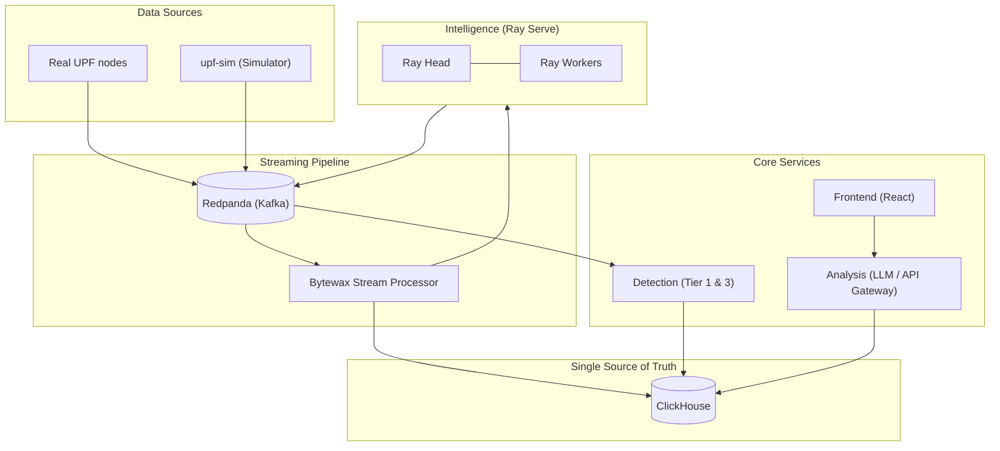

# BESS-UPF AI (v2 Kubernetes Stack)

Intelligent monitoring and analysis platform for 5G User Plane Functions.
Collects metrics from UPF nodes, runs real-time anomaly detection, generates capacity forecasts, and exposes a conversational LLM interface for operators and management.

---

## Architecture

The platform operates on a single-path streaming architecture deployed entirely on Kubernetes:



All backend services run natively in Kubernetes. Network isolation is enforced via `NetworkPolicies` and mTLS via Linkerd.

---

## Quick Start (Kubernetes)

### Prerequisites
- Kubernetes cluster (e.g., minikube, kind, EKS, GKE)
- `kubectl` and `helm` installed
- NVIDIA GPU (Optional, for LLM and ML inference acceleration)

### Deployment

Deploy the entire stack using the provided Helm chart:

```bash
# 1. Create namespace
kubectl create namespace bess-upf

# 2. Install the Helm chart
helm install bess-upf ./charts/bess-upf -n bess-upf
```

Wait for all pods to become ready:
```bash
kubectl get pods -n bess-upf -w
```

### Accessing the UI

The frontend is exposed via an Ingress resource on `bess-upf.local`.

```bash
# Add to /etc/hosts if running locally
echo "127.0.0.1 bess-upf.local" | sudo tee -a /etc/hosts

# Open in browser
open https://bess-upf.local
```

---

## Data Flow in Detail

### 1 — Metric Ingestion (Redpanda + Bytewax)
UPF telemetry is ingested directly into Redpanda topics (e.g., `upf.metrics.raw`). Bytewax stream processors consume these topics, normalize the data, apply a 15-second tumbling window, and write the canonicalized metrics into ClickHouse.

### 2 — Anomaly Detection (Ray + Go)
**Tier 2 (ML):** Ray Serve hosts MOMENT and Chronos-2 models. It subscribes to the normalized metrics stream from Redpanda, detects anomalies in real-time, and publishes to the `upf.anomalies.critical` topic.

**Tier 1 & 3 (Statistical & Forecasting):** The Go detection service consumes the anomalies topic, enriches events with metadata, evaluates statistical thresholds, and persists the final event record to ClickHouse.

### 3 — LLM Analysis
The Analysis service (`analysis/internal/api/handler.go`) acts as the primary API gateway. It provides a conversational LLM interface that queries ClickHouse directly to answer operator questions and perform Root Cause Analysis (RCA).

---

## Tier 2 AI — MOMENT + Chronos-2

The Tier 2 AI subsystem adds **multivariate anomaly detection** (MOMENT) and **probabilistic UOI forecasting** (Chronos-2) running on Ray Serve.

### Training and Retraining
The continuous learning loop automatically retrains models when operators dismiss anomalies as false positives.

```bash
# 1. Prepare dataset (Reads feedback from ClickHouse/SQLite)
python tools/train/prepare_dataset.py --db-path ./data/audit.db

# 2. Fine-tune MOMENT head
python tools/train/train_moment.py

# 3. Evaluate + fine-tune Chronos
python tools/train/train_chronos.py

# 4. Deploy canary to Ray Serve
python serve/deploy_models.py --canary
```

---

## Operations & Disaster Recovery
Please refer to [RUNBOOK.md](./RUNBOOK.md) for detailed operational procedures, including ClickHouse backups, Redpanda recovery, and Ray cluster management.
