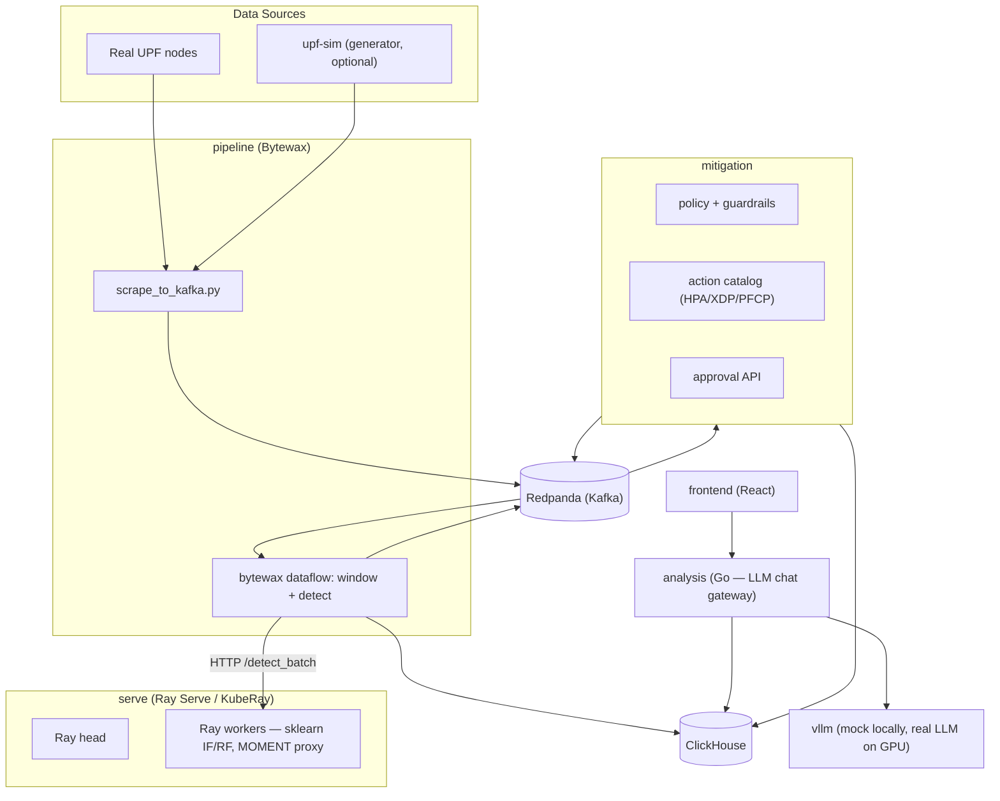

# BESS-UPF AI (v2 Kubernetes Stack)

Intelligent monitoring and analysis platform for 5G User Plane Functions.
Streams UPF telemetry through Kafka-compatible Redpanda, detects anomalies
in real time (statistical + ML), stores everything in ClickHouse, and
exposes policy-gated automated mitigation plus a conversational LLM
interface for operators.

---

## Architecture



**Services** (each a top-level dir + matching Helm subchart under `charts/bess-upf/charts/`):
- `pipeline` (Python/Bytewax) — scrapes UPF metrics into Redpanda, windows per-UPF, calls `serve` for ML scoring, publishes anomalies.
- `serve` (Python, runs on a KubeRay `RayCluster`) — sklearn IsolationForest/RandomForest + MOMENT proxy embedding; `deploy_models.py` runs once as a Helm post-install/upgrade hook Job.
- `mitigation` (Python/FastAPI) — policy-driven trust ladder (OBSERVE→RECOMMEND→APPROVE→AUTO), rate-limit/blast-radius guardrails, action catalog, approval API, audit trail to ClickHouse.
- `analysis` (Go) — API gateway; conversational LLM interface over `vllm`, queries ClickHouse for RCA.
- `frontend` (React) — operator dashboard.
- `upf-sim` (Go) — the **generator**: synthetic UPF traffic/metrics for local dev and testing. Disable it (`--no-generator`) when a real UPF feeds the pipeline instead.
- `redpanda`, `clickhouse` — Kafka-compatible streaming backbone and single source of truth.
- `vllm` — LLM backend for `analysis`'s chat feature. Runs in **mock mode** by default (canned responses) since it needs a real GPU node otherwise (CUDA image, no CPU fallback) — see [RUNBOOK.md](./RUNBOOK.md).

---

## Quick Start

### Prerequisites
- Docker (daemon running)
- `kind`, `kubectl`, `helm` on PATH
- Python 3.7+

### Install

```bash
python install.py                  # full stack; upf-sim (generator) OFF by default
python install.py --generator      # include upf-sim — use for local dev without a real UPF
python install.py --skip-build     # redeploy without rebuilding images
```

This brings up (or reuses) a local `kind` cluster, builds and loads every
service image, installs `kuberay-operator`, helm-installs the full chart,
and waits until every pod is actually healthy. Safe to re-run.

The frontend/API are reachable at `http://localhost:8080` immediately after
install completes — no manual `kubectl port-forward` needed. Override the
port via `.env`'s `LOCAL_PORT` (see `.env.example`).

### Accessing the UI

The frontend is exposed via `ingress-nginx` as a `NodePort` service in this
dev setup:

```bash
kubectl get svc -n bess-upf bess-upf-ingress-nginx-controller
# hit http://localhost:<nodePort>
```

---

## Data Flow in Detail

### 1 — Ingestion + Windowing (`pipeline`)
`scrape_to_kafka.py` polls the UPF metrics endpoint (real UPF or `upf-sim`)
and publishes raw samples to the Redpanda topic `upf.metrics.raw`. The
Bytewax dataflow (`pipeline/app.py`) consumes that topic, keys by UPF ID,
maintains a 60-sample sliding window per UPF, and once full, batches
windows (`op.collect`, per-key) and calls `serve`'s `/detect_batch` HTTP
endpoint for scoring — combining a statistical z-score check with the ML
result before publishing anomalies to `upf.anomalies.critical`.

### 2 — ML Scoring (`serve`)
Ray Serve (via KubeRay) hosts an IsolationForest + RandomForest ensemble
plus a MOMENT proxy embedding path, backed by `/models` (mounted from the
host in local dev). `deploy_models.py` registers/validates models once per
deploy as a Helm hook Job.

### 3 — Mitigation (`mitigation`)
Consumes anomalies, classifies an `ActionClass` via policy rules, checks
guardrails (rate limit + blast radius), and — depending on trust level —
either just observes, recommends, requires human approval (`/approve`,
`/deny`, `/pending` on the approval API), or executes automatically
(`AUTO`). Every decision is audited to ClickHouse via Kafka.

### 4 — LLM Analysis (`analysis`)
The Go API gateway provides a conversational interface backed by `vllm`,
querying ClickHouse directly to answer operator questions and perform
Root Cause Analysis.

---

## Operations
See [RUNBOOK.md](./RUNBOOK.md) for ClickHouse backup/restore, Redpanda
recovery, Ray cluster recovery, and known local-dev gotchas.
