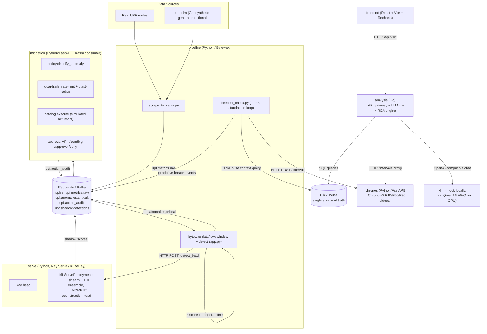

# CoreWatch — Technical & Logical Handover Document

**A multi-tier, foundation-model-augmented anomaly detection and autonomous mitigation platform for 5G User Plane Functions**

*Document type: engineering handover / technical report*
*Scope: full-stack architecture, detection logic, model lifecycle, mitigation policy, deployment, and operations*

---

## Abstract

CoreWatch is an intelligent monitoring platform for the User Plane Function (UPF) of a 5G core network. A UPF is the component that actually forwards subscriber data traffic between the radio network (via the N3 interface) and the internet/data network (via N6); if it degrades, subscribers lose throughput or sessions outright. This project ingests UPF telemetry in real time, runs a five-tier anomaly detection stack that blends hand-written statistical rules with two time-series *foundation models* (MOMENT-1-large for multivariate reconstruction, Chronos-2 for probabilistic forecasting), converts detected anomalies into policy-gated automated or human-approved remediation actions, and exposes a conversational LLM interface so operators can ask natural-language questions about what is happening and why. The whole stack — streaming ingestion, ML serving, mitigation, LLM analysis, and a React dashboard — runs as a single Kubernetes application, brought up locally in a `kind` cluster with one command (`python install.py`) and structured so the same Helm chart can be pointed at a production cluster. This document is written for an engineer or reviewer picking up the project cold: it explains what exists, why it was built this way, what is verified vs. unverified, and what needs attention before the next phase of work.

---

## Table of Contents

1. [Project Scope & Motivation](#1-project-scope--motivation)
2. [System Architecture](#2-system-architecture)
3. [Detection Pipeline In Depth](#3-detection-pipeline-in-depth)
4. [Model Training & Lifecycle](#4-model-training--lifecycle)
5. [Mitigation & Guardrails](#5-mitigation--guardrails)
6. [LLM-Based Root Cause Analysis](#6-llm-based-root-cause-analysis)
7. [Data Ingestion & Streaming Backbone](#7-data-ingestion--streaming-backbone)
8. [Frontend / Operator Dashboard](#8-frontend--operator-dashboard)
9. [Deployment & Infrastructure](#9-deployment--infrastructure)
10. [Local Dev & Ops Runbook](#10-local-dev--ops-runbook)
11. [Testing & Evaluation](#11-testing--evaluation)
12. [Known Issues, Risks & Handover Notes](#12-known-issues-risks--handover-notes)
13. [Glossary of Domain Terms](#13-glossary-of-domain-terms)

---

## 1. Project Scope & Motivation

### 1.1 The problem

A UPF's health cannot be summarized by a single number. It exposes dozens of correlated time series: PFCP (Packet Forwarding Control Protocol) session counts, per-interface (N3/N6) byte and packet rates, drop rates, Go runtime internals (goroutines, heap, GC pressure), and derived efficiency ratios. Classical static thresholds ("alert if drops > X") are what most monitoring stacks ship with, and they fail in two directions at once: they're too rigid to capture the multivariate, correlated nature of a real degradation (e.g. a session overload that also perturbs throughput efficiency and GC pressure simultaneously), and they can't distinguish "this looks unusual" from "this looks unusual *and* is heading toward a capacity breach in the next 30 minutes."

### 1.2 The research contribution

Per the project's own design notes (`docs/superpowers/specs/2026-06-27-bess-upf-research-grade-design.md`), the explicit, stated contribution is:

> "First end-to-end evaluation of a *multi-scale foundation model ensemble* (MOMENT-1-large reconstruction + Chronos-2 prediction-interval breach) against classical and statistical baselines on 5G UPF telemetry, with calibrated uncertainty, LLM-generated RCA, and a live in-app ablation benchmark."

Concretely, this means two pretrained time-series foundation models are used *in addition to* classical rules and classical ML, and the system is instrumented to prove — via an actual, running ablation harness (`tools/train/ablation.py`, output at `models/ablation_report.json`/`.md`, served at `GET /api/v1/benchmark`) — whether each tier is pulling its weight, rather than asserting it.

### 1.3 Who this is for

The intended operator is a network/SRE team responsible for UPF uptime: they need (a) early warning before a capacity breach, not just a reactive alert after one, (b) an explanation of *why* an anomaly happened that doesn't require them to manually correlate a dozen dashboards, and (c) confidence that automated remediation won't itself cause an incident — hence the trust-ladder mitigation design in §5.

### 1.4 A note on current data honesty

The same design doc records a critical, now largely addressed finding: an earlier training report showed **0% anomaly recall on both sklearn models**, root-caused to a time-ordered 80/20 split that placed all injected anomaly windows into the training set (i.e., the eval set had zero anomalies to detect). This has since been fixed with a *stratified episode split* (see §4.3) — `models/split_report.json` shows `split_ratio: 0.8`, `n_episodes: 426`, `anomaly_rows_train: 2100`, `anomaly_rows_eval: 637` (`anomaly_eval_fraction: 0.2327`), i.e. the eval set now genuinely contains labeled anomalies. This is called out explicitly because it's exactly the kind of silent-but-fatal bug a new engineer should know already happened once.

---

## 2. System Architecture

### 2.1 End-to-end data flow

The mermaid diagram above is a synthesis of README.md's own architecture diagram plus code-level detail (Chronos sidecar, forecast_check.py, shadow publishing) that the README's higher-level version omits.

### 2.2 Service inventory

| Service | Language / Runtime | Port | Purpose | Dockerfile base image |
|---|---|---|---|---|
| `pipeline` | Python 3 (Bytewax dataflow) | — (no HTTP; Kafka in/out) | Scrapes UPF `/metrics`, publishes to Kafka, windows per-UPF, calls `serve` for scoring, runs the independent Tier-3 forecast-breach loop | `python:3.10-slim` |
| `serve` | Python 3 (Ray Serve / KubeRay `RayCluster`) | 8000 | Hosts the sklearn IsolationForest+RandomForest ensemble and the MOMENT reconstruction head; `/detect`, `/detect_batch`, `/forecast` (stub), `/health` | `pytorch/pytorch:2.1.0-cuda11.8-cudnn8-runtime` |
| `chronos` | Python 3 (FastAPI) | 8084 | Chronos-2 (`amazon/chronos-t5-small`, or a fine-tuned checkpoint) forecast sidecar; `POST /intervals` returns P10/P50/P90 bands | `python:3.11-slim` |
| `mitigation` | Python 3 (FastAPI + Kafka consumer thread) | 8081 | Consumes `upf.anomalies.critical`, classifies an `ActionClass`, applies guardrails, executes/queues/observes per trust level, audits every decision | `python:3.10-slim` |
| `analysis` | Go 1.22 | 8082 | API gateway: REST endpoints for the dashboard, LLM chat orchestration, structured RCA engine, ClickHouse query layer, Chronos proxy | `golang:1.22-alpine` (build) → `alpine:3.21` (runtime) |
| `frontend` | React 18 + TypeScript + Vite + Recharts + Zustand + TanStack Query | 80 (nginx) | Operator dashboard: overview, forecast, anomalies, insights, chat, benchmark, scenario views | `node:20-alpine` (build) → `nginx:alpine` (runtime) |
| `upf-sim` | Go 1.22 | 8090 | Synthetic UPF traffic/metrics generator for local dev without a real UPF; off by default, enabled via `install.py --generator` | `golang:1.22-alpine` (build) → `alpine:3.19` (runtime) |
| `tools` | Python (training/eval scripts, run as Jobs, not a long-running service) | — | `tools/train/*.py`: dataset prep, model training (sklearn, MOMENT, Chronos), ablation evaluation, drift detection | `python:3.12-slim` |
| `redpanda` | Kafka-API-compatible broker (Helm subchart) | 9092 | Streaming backbone for all inter-service async messaging | (subchart-managed) |
| `clickhouse` | OLAP database (Helm subchart, 3-replica `ReplicatedMergeTree` StatefulSet) | 8123 | Single source of truth for raw metrics, `anomaly_events`, and audit logs | (subchart-managed) |
| `vllm` | `vllm/vllm-openai` or mock | 8000 (own namespace) | OpenAI-compatible LLM backend for `analysis`'s chat/RCA features | (subchart-managed; mock by default) |
| `eval/` (Go) | Go, standalone CLI | — | Adversarial red-team harness against the chat endpoint's PromQL/query-injection surface | n/a (`go run ./eval/`) |
| `install.py` | Python 3.7+ stdlib only | — | One-shot local installer/orchestrator: kind cluster, image build/load, Helm install, health wait | n/a (runs on bare host) |

Every service directory has a matching Helm subchart under `charts/bess-upf/charts/<service>/`, declared as a dependency in `charts/bess-upf/Chart.yaml`.

---

## 3. Detection Pipeline In Depth

Anomaly detection is deliberately **tiered** — cheap/interpretable checks run first, expensive/opaque ones only when useful, and the system evaluates each tier independently (`tools/train/ablation.py`) so its actual marginal value is measurable rather than assumed.

### 3.1 Tier 1 — Statistical z-score / threshold rules

Defined declaratively in `config/detection/rules.yml`, but **that specific file is explicitly marked ORPHANED** in its own header comment: it describes a pre-V2, docker-compose-based architecture with a standalone "detection" service polling PromQL, which no longer exists in the current Helm/K8s deployment. The file is kept only as human-readable documentation of thresholds and reasoning, cross-referenced by `pipeline/forecast_check.py`'s and `tools/train/ablation.py`'s comments, and by `frontend/src/features/forecast/ForecastPage.tsx`. The **actually-live** Tier-1 logic lives inline in `pipeline/app.py`'s `_call_detect_batch()`:
- `port_dropped_N3_rx_rate`: fires if z-score > 2.5 **and** the current value exceeds mean+std.
- `pfcp_sessions_total`: fires if `|z-score| > 3.0`.

Both z-scores are computed against the same 60-sample rolling window (`pipeline/window.py`'s `WindowState`, `WINDOW_SIZE = 60`) that feeds the ML tiers, so Tier 1 and Tier 2 always see identical context. When Tier 1 fires, it force-overrides `model_version` to `"statistical-zscore-v1"` and **unions** (not replaces) its flagged channels into the ML result's `top_anomalous_channels` — a deliberate design choice documented inline: "the reactive z-score tier must win so `ClassifyAnomaly` tags this 'reactive' instead of 'ml'."

`config/detection/rules.yml`'s documented thresholds (for reference, since they inform `tools/train/ablation.py`'s `T1_THRESHOLDS` dict): `pfcp_sessions_total` z-score threshold 2.5 / max 2,000,000 (critical); `port_bytes_count` z-score threshold 2.5; `port_dropped_count` z-score threshold 2.0 (drops are treated as always-serious, hence the lower bar).

### 3.2 Tier 2a — sklearn IsolationForest + RandomForest ensemble

Hosted in `serve/app.py`'s `MLServeDeployment`. On each `/detect`/`/detect_batch` call:
1. `feature_eng.extract_features()` converts the (14-channel × 60-sample, per `pipeline/window.py`'s `ML_CHANNELS`) window into a fixed **39-feature** vector (`SKLEARN_FEATURE_NAMES` in `serve/feature_eng.py`) — the last value, ratio, and 5-minute rolling mean/std/min/max of 7 mapped channels, matching `models/scaler_params.json`.
2. `StandardScaler.transform()` (loaded from `models/scaler.joblib`).
3. IsolationForest `decision_function()` — anomaly if `if_score < _IF_THRESHOLD` (loaded from `models/metadata.json`'s `thresholds.isolation_forest`, currently `0.0`).
4. RandomForest `predict_proba()` — anomaly if `rf_proba >= 0.5`.
5. Final `anomaly = if_anomaly OR rf_anomaly`; `anomaly_score` is `rf_proba` when RF is loaded, else `max(0, -if_score)`.

Current eval metrics from `models/metadata.json` (trained 2026-07-11): IsolationForest `roc_auc=0.9228`, `recall_anomaly=0.022`, `false_positive_rate=0.0`; RandomForest `roc_auc=0.9173`. The **ablation report** (`models/ablation_report.md`, generated 2026-07-11 15:29 UTC, eval hash `a8709602345d5d25`) gives the fuller per-tier picture:

| Tier | Method | Precision | Recall | F1 | AUC-ROC | Latency P50 |
|---|---|---|---|---|---|---|
| T1 | Z-score Rules | 0.761 | 0.286 | 0.415 | 0.6266 | 0.04 ms |
| T2a-IF | Isolation Forest | 1.000 | 0.124 | 0.221 | 0.562 | 3.47 ms |
| T2a-RF | Random Forest | 0.672 | 0.920 | 0.777 | 0.8786 | 12.81 ms |
| T2b-zs | MOMENT Zero-Shot | 1.000 | 0.250 | 0.400 | 0.625 | 0.00 ms |
| T2b-ft | MOMENT Fine-Tuned Head | — | — | — | — | *(unavailable at report time)* |
| **Ensemble** | T1 OR T2a-RF OR T2b-zs | **0.605** | **0.957** | **0.741** | — | — |

Note the two `roc_auc` figures for IF (`0.9228` in `metadata.json` vs. `0.562` in the ablation report) come from different evaluation methodologies/dates — `metadata.json` is the training-time self-report, the ablation report is the later, more rigorous stratified-eval-split measurement. **Treat the ablation report as authoritative** since it's the one built specifically to avoid the leakage bug described in §1.4.

### 3.3 Tier 2b — MOMENT-1-large multivariate reconstruction (primary ML signal)

`serve/moment_loader.py` implements a **reconstruction-error anomaly head**: an autoencoder (`ReconstructionAnomalyHead`, mirrored exactly from `tools/train/train_moment.py` so `state_dict` shapes match) trained *only on normal windows*; its score is mean-squared reconstruction error against a precomputed threshold (`mean + n_sigma*std` on normal windows, baked into `models/moment_threshold.json`).

Two embedding paths exist, chosen automatically:
- **Real path** (`_make_real_embedding`): loads the actual `AutonLab/MOMENT-1-large` pretrained backbone via `momentfm.MOMENTPipeline`, builds a `(n_channels, 512)` window in `models/moment_channel_names.json`'s exact channel order (any channel the live pipeline doesn't provide is zero-filled, not dropped, to keep tensor shape fixed), and reads off the reconstruction output.
- **Proxy path** (`_make_proxy_embedding`): if the real backbone can't load (no network, OOM, package missing — all explicitly anticipated, best-effort only), falls back to a hand-built embedding: per-channel mean+std, tiled/truncated to the trained embedding dimension, L2-normalized. This is *not* a MOMENT embedding at all, just a deterministic placeholder shaped like one — a new engineer should be aware that "MOMENT is running" doesn't always mean the real foundation model backbone is loaded; check `serve`'s startup log line `"MOMENT head loaded (%s mode, ...)"` — it explicitly logs `"real"` vs `"proxy"`.

This tier is called out in README/architecture docs as **PRIMARY** among the ML tiers — it's the one whose top-3 deviant channels (via `channel_zscores` in `feature_eng.py`, a pragmatic z-score attribution proxy, explicitly *not* true SHAP) feed the LLM RCA engine's evidence-gathering (§6).

### 3.4 Tier 2c — Chronos-2 prediction-interval breach (uncertainty tier)

`chronos/app.py` serves `amazon/chronos-t5-small` (or a fine-tuned checkpoint under `models/chronos_finetuned/` if `models/chronos_metadata.json`'s `use_finetuned` is true). `POST /intervals` takes `{channel, context, horizon}` and returns P10/P50/P90 percentile bands via `ChronosPipeline.predict()` with `num_samples=20`. Per the design doc, an anomaly signal is meant to fire "when observed value falls outside `[P10 − σ, P90 + σ]` for 3+ consecutive timesteps" — **this specific breach-classification logic does not appear to live inside `chronos/app.py` itself**, which only returns raw bands; the consuming logic that would apply the σ-slack breach rule lives in `pipeline/forecast_check.py` (§3.5) in a related but distinct form (comparing the raw P90 against a fixed capacity, not a σ-adjusted band around the current channel).

Current model metadata (`models/chronos_metadata.json`, generated 2026-06-30): `base_model: amazon/chronos-t5-small`, `context_length: 512`, `forecast_horizon: 20`, `use_finetuned: false` (zero-shot is currently in production), `zero_shot_metrics: {wql: 0.033691, mis: 0.4836, calibration: 0.4238}` — identical to `final_metrics`, confirming zero-shot was chosen over fine-tuning (see §4.4 for why). `quantiles: [0.1, 0.5, 0.9]` — i.e. **P10/P90 is an 80%-coverage interval**, not 85% or 90%. This is directly relevant to the "85% target" question addressed in §12.

### 3.5 Tier 3 — OLS capacity forecast (predictive, pre-breach warning)

Runs as an **independent background process** (`pipeline/forecast_check.py`), not inside the Bytewax dataflow graph — the code comment explains why: Bytewax's `Dataflow` is message-driven off the Kafka source with no straightforward periodic/timer input, so a plain polling loop with its own Kafka producer was the simpler fit. Every `FORECAST_CHECK_INTERVAL_SECS` (default 60s), for each of three `FORECAST_TARGETS`:

| Metric | Capacity | Notes |
|---|---|---|
| `pfcp_sessions_total` | 50,000 | per-node; typical spike ~48k sits at 96% of this |
| `pfcp_sessions_total_cluster` | 65,000 | cluster-wide sum; only worst-case (diurnal peak + spike, ~64k) nears this |
| `port_bytes_count` | 75,000,000 (75 MB/s) | N3 inbound; typical spike ~57.6 MB/s (77%), worst-case ~76.4 MB/s breaches |

it fetches ~1h of context from ClickHouse, POSTs to the Chronos sidecar with `horizon="long"` (Chronos's `HORIZON_STEPS["long"] = 30` steps × `STEP_SECONDS=60` = **30-minute max lookahead** — the code explicitly notes this is short of the full 1-hour horizon `config/detection/rules.yml` *documents* as the target, since `chronos/app.py` only supports "short"/"long" as horizon labels, not an arbitrary duration), and checks whether the **P90** (upper) band crosses the fixed capacity at any point in the forecast. If so, it publishes a predictive `upf.anomalies.critical` event with `model_version: "chronos-forecast-v1"` and a `predicted_crossing_time`. A dedup window (`horizon/2 = 15 min`) suppresses re-firing.

### 3.6 Ensemble logic

At the `pipeline/app.py` level: `anomaly = stat_anomaly OR ml_res["anomaly"]` (where `ml_res["anomaly"]` already incorporates IF/RF/MOMENT via `serve`'s own OR-logic). At the ablation-evaluation level (`tools/train/ablation.py`), the headline "Ensemble" figure is `T1 OR T2a-RF OR T2b-zs`, achieving recall 0.957 / precision 0.605 / F1 0.741 — i.e., the ensemble is explicitly recall-optimized (catch almost everything, accept more false positives) rather than precision-optimized, consistent with an early-warning use case where a missed capacity breach is more costly than an extra investigation.

---

## 4. Model Training & Lifecycle

### 4.1 Data sources

`tools/train/prepare_dataset.py` can read from a local CSV (`prometheus_full_export_20260622_115327.csv`, ~13 days of real UPF data) or from `tools/train/generate_synthetic_data.py`'s synthetic output (1 year, 15s cadence, ~2.1M rows) — the latter models diurnal patterns (business hours 1.5×, night 0.3×), weekly patterns (weekday full, Sat 0.6×, Sun 0.4×), Indian public holidays (0.3×), 2-3 maintenance windows/month, and ~4% of timesteps as one of 5 clustered anomaly scenario types (session_overload, traffic_spike, datapath_fault, memory_pressure, maintenance).

### 4.2 Preparation

`prepare_dataset.py` resamples to 15s cadence, converts counters to per-second rates (clipping negative diffs from counter resets to NaN rather than silently treating them as real drops), forward-fills slow-cadence columns up to 6 steps, computes a binary `uoi_binary` label (UPF Overload Index > 75th percentile of the training set), and builds both MOMENT sliding windows (512 steps, 128-step stride) and a Chronos univariate series.

### 4.3 The stratified split fix

`_stratified_episode_split()` (referenced by `train.py`'s docstring) replaced the old time-ordered 80/20 split responsible for the 0%-recall bug (§1.4). `models/split_report.json` records the result: 426 anomaly episodes identified, split 0.8/0.2 by episode (not by row) so that no single anomaly episode straddles the train/eval boundary, yielding `n_train=9126` / `n_eval=2394` rows with `anomaly_eval_fraction=0.2327` — meaning the eval set is now deliberately anomaly-rich rather than accidentally anomaly-free.

### 4.4 Per-model training scripts

- **`train.py`** (Tier 2a): trains IsolationForest (unsupervised, normal-only) and RandomForestClassifier (supervised, `RF_N_TREES=100`) on an 80/20 **time-based** split of the prepared dataset (not random-shuffled, to avoid temporal leakage). IF's threshold is calibrated for a target false-positive rate (`IF_FP_RATE=0.01`, i.e. 1%) rather than picked arbitrarily. Outputs: `isolation_forest.joblib`, `random_forest.joblib`, `scaler.joblib`, `scaler_params.json` (mean+scale per feature, so a **Go** service could theoretically re-implement scaling without a Python dependency — not currently done, but the artifact is shaped for it), `metadata.json`, `training_report.md`.
- **`train_moment.py`** (Tier 2b): **linear probing only** — the MOMENT-1-large encoder is frozen; only a small MLP anomaly head is trained on top of its embeddings. The docstring is explicit about why full fine-tuning was rejected: only ~74 windows survive after 15s resampling of the ~76k-row dataset, and overfitting risk at that sample size was judged too high. If eval F1 < 0.60, the script is designed to "report it honestly" rather than hide it — a good-practice signal about this project's evaluation culture. `BATCH_SIZE=16` (GPU) / would be 2 on CPU, `EPOCHS=50`, `EARLY_STOP=10`, `SEED=42`.
- **`train_chronos.py`** (Tier 2c): explicit protocol — zero-shot evaluate FIRST, only adopt the fine-tuned checkpoint if WQL improves by ≥ `MIN_WQL_IMPROVEMENT = 0.05` (5%) over zero-shot. `models/chronos_metadata.json`'s `use_finetuned: false` and identical zero-shot/final metrics confirm fine-tuning did **not** clear that bar on the last run, so the model in production today is the stock `amazon/chronos-t5-small` zero-shot. `CONTEXT_LEN=512`, `FORECAST_HORIZON=20` steps × `RESAMPLE_S=15` = 5 minutes, `EPOCHS=20`, `EARLY_STOP=5`.
- **`ablation.py`**: the evaluation harness described in §3.2/3.6, producing `models/ablation_report.json`/`.md`. Notably it re-implements T1's z-score logic in pure Python (`T1_THRESHOLDS`) rather than shelling out to a Go binary, explicitly to keep the harness self-contained.
- **`drift_detect.py`**: reads the `anomaly_feedback` table (populated by the frontend's confirm/dismiss actions via `analysis`'s `POST /api/v1/feedback` → SQLite `audit.db`) and computes the operator-reported false-positive rate over a trailing window. If it exceeds `DRIFT_THRESHOLD = 0.15` (15%) with at least `MIN_FEEDBACK_EVENTS = 5` events, it's designed to trigger a retrain — this closes the loop from "operator says this was wrong" back to "model gets retrained," though whether this is wired into a scheduled job vs. run manually should be confirmed with whoever owns MLOps next.

### 4.5 Deployment of trained models

`serve/deploy_models.py` runs as a **Helm post-install/post-upgrade hook Job** (see `charts/bess-upf/charts/serve/templates/deploy-models-job.yaml`), not as part of the long-running pod command — it must execute inside the cluster's Ray runtime via `ray job submit`, because running it as a bare pod with only `RAY_ADDRESS` set silently connects to a throwaway local Ray instance that vanishes with the pod (documented pitfall in the script's own comments). A `--canary` flag exists but is currently a **simulated** canary (a 2-second sleep, then full rollout) — real weighted-traffic canary routing via a custom Ray Serve router is not implemented yet. `host="0.0.0.0"` in `serve.start(http_options=...)` is load-bearing: the comment records that omitting it silently defaults to loopback-only, making `/detect_batch` completely unreachable from `pipeline` even though the pod itself looked healthy.

### 4.6 Models directory contents (as of this handover)

`isolation_forest.joblib`, `random_forest.joblib` (not listed in the directory scan performed this session — confirm it's present before assuming RF-based scoring is active in your environment), `scaler.joblib`, `scaler_params.json`, `metadata.json`, `moment_head.pt`, `moment_threshold.json`, `moment_channel_names.json`, `chronos_finetuned/` (directory), `chronos_metadata.json`, `correlation_graph.json` (consumed by the RCA engine, §6), `feature_columns.json`, `split_report.json`, `ablation_report.json`/`.md`, `stl_profiles.json` (not read in depth this session — likely seasonal-decomposition profiles, worth checking before relying on it).

---

## 5. Mitigation & Guardrails

### 5.1 Trust-ladder design

`mitigation/policy.py` defines the core policy: every anomaly event is classified into an `ActionClass` (`HPA_SCALE_UP`, `XDP_RATE_LIMIT`, `PFCP_REROUTE`, or `NO_ACTION`) and a `TrustLevel` (`OBSERVE`, `RECOMMEND`, `APPROVE`, `AUTO`). `classify_anomaly()`:
1. If `anomaly_score < MIN_CONFIDENCE` (0.6) → `NO_ACTION`/`OBSERVE`.
2. Else, if any top-anomalous-channel is in `_DROP_CHANNELS` (`port_dropped_N6_rx_rate`, `port_dropped_N3_rx_rate`) → `XDP_RATE_LIMIT`.
3. Else, if any is in `_PFCP_CHANNELS` (`pfcp_sessions_total`, `pfcp_session_setup_rate`) → `PFCP_REROUTE`.
4. Else → `HPA_SCALE_UP`.

The **current trust mapping** (`TRUST_LEVELS` dict) is conservative: only `HPA_SCALE_UP` is `AUTO`; both `XDP_RATE_LIMIT` and `PFCP_REROUTE` are `OBSERVE` — i.e., **as currently configured, network-path-altering actions (rate limiting, rerouting) are never auto-executed**, only logged as dry-run observations. Only horizontal pod autoscaling is trusted to run unattended. `TrustLevel.APPROVE`, though defined in the enum and fully handled in `mitigation/app.py`'s `_handle_event()`, has **no `ActionClass` currently mapped to it** — the human-approval path exists and is wired end-to-end (approval store, `/pending`/`/approve`/`/deny` API) but is presently dead code in terms of live traffic reaching it. This is worth flagging to whoever owns the policy: either it's intentionally staged for a future action class, or it's a gap.

### 5.2 Guardrails (independent of trust level, apply only to `AUTO`)

`mitigation/guardrails.py`: a `RateLimiter` (max 3 actions per `(ActionClass, upf_id)` pair per 300s) and a `BlastRadiusGuard` (max 5 distinct UPFs per `ActionClass` per 300s), combined in `GuardrailsEngine.check()` (both must pass). These only gate the `AUTO` path in `_handle_event()` — `OBSERVE`/`RECOMMEND` dry-runs and `APPROVE` queuing bypass guardrails entirely (by design: a dry-run or a human-gated action can't runaway).

### 5.3 Action catalog

`mitigation/catalog.py`'s `execute()` dispatches to one of three **simulated actuators** (`_sim_hpa`, `_sim_xdp`, `_sim_pfcp`) — each logs, sleeps 50ms, and returns a fabricated `rollback_token`. **None of these currently call a real Kubernetes API, XDP program, or PFCP session-management endpoint** — this is a simulation/demo-grade actuator layer, not production remediation. A `rollback()` function exists but only logs "Rollback requested" — it does not actually reverse anything. Anyone extending this toward real production actions needs to implement the real actuator bodies and real rollback logic; the interface contract (`ActuatorResult` dataclass with `rollback_token`) is already in place to receive that work.

### 5.4 Audit trail

Every decision — dry-run, auto-executed, or guardrail-blocked-and-skipped — that reaches `execute()` is published to Kafka topic `upf.action_audit` via `mitigation/audit.py`'s `AuditPublisher` (NaN-safety: `anomaly_score` NaN is coerced to 0.0 before JSON serialization, since `json.dumps(..., allow_nan=False)` would otherwise raise). This lands in ClickHouse (consumed by whichever pipeline sinks that topic — not traced in this session, but the topic is the documented contract) and is separately queryable in `analysis`'s Go service via a SQLite-backed structured audit log (`GET /api/v1/audit`) that also captures LLM/tool-call interactions, a distinct audit surface from the mitigation-action audit.

### 5.5 Approval API

`mitigation/api.py` (FastAPI, served on its own thread inside `mitigation/app.py`'s `main()`): `GET /pending` lists queued approvals, `POST /approve/{id}`/`POST /deny/{id}` decide them (idempotent — re-deciding an already-decided or unknown ID returns 404), and `POST /feedback/{id}` accepts operator true/false-positive labels, republished raw to `upf.feedback` (a third feedback channel alongside `analysis`'s `/api/v1/feedback` → SQLite path — confirm with the team whether these two feedback paths are meant to converge somewhere or are genuinely parallel/redundant).

---

## 6. LLM-Based Root Cause Analysis

Two related but distinct LLM-driven surfaces exist in `analysis` (Go):

### 6.1 Conversational chat (`llm.Orchestrator`, `POST /api/v1/chat`)

General-purpose Q&A over the system: takes a free-text operator message, keyed by `session_id` (auto-generated if absent), routes through an orchestrator with a `MaxIter: 4` tool-use loop, backed by a keyword-based RAG retriever (`internal/rag/keyword.go`, reading docs from `RAG_DOCS_DIR`, default `/docs`) and ClickHouse query tools. Session state has a `SessionTTL` (default 30m) with a background cleanup goroutine. Every request is logged to the structured audit log and rate-limited (600/minute via `api.NewRateLimiter`).

### 6.2 Structured RCA engine (`llm.RCAEngine`, `POST /internal/analyze_anomaly`)

This is the more novel piece: given a `RCARequest` (anomaly score, threshold, top channels + per-channel scores, optional breach probability/ETA, model version provenance), it:
1. **Loads the correlation graph** (`models/correlation_graph.json`, lazy-loaded once via `sync.Once`) and, if any of the top-anomalous channels appear as an edge endpoint, injects up to 5 of the strongest lagged-correlation edges into the prompt as causal context — explicitly instructing the LLM to "describe the causal chain... rather than listing metrics independently."
2. **Gathers live evidence**: for each top channel, queries ClickHouse (via a hardcoded `channelPromQL` map covering 16 known channels — anything outside this map is silently skipped, so a channel added to the ML pipeline without a corresponding entry here won't get live-evidence enrichment) for the current value, plus the current UOI value unconditionally.
3. **Builds a structured prompt** with a strict JSON-only response contract (severity/cause/summary/evidence/recommended_actions/confidence/eta_minutes/model_attribution) and a domain-primed system prompt explaining UPF/N3/N6/PFCP/UOI/TSI terminology to the LLM.
4. **Calls the LLM** with `Temperature: 0.1`, `MaxTokens: 800`, an 8-second timeout.
5. **Parses defensively**: strips markdown code fences, extracts the first `{...}` block, and on any parse failure falls back to `fallbackReport()` — a fully deterministic, LLM-free report (severity from score/threshold ratio thresholds of 3× and 5×) that is honestly labeled `"MOMENT-1-large statistical fallback (LLM unavailable)"` rather than silently presenting a degraded result as a normal one.
6. **Sanitizes** the final report (clamps confidence to [0,1], enum-checks severity, ensures required fields are non-empty).

**Important caveat found in code**: `handleAnalyzeAnomaly` in `analysis/internal/api/handler.go` is explicitly commented as "Internal endpoint: not routed through Caddy, no external caller wired up yet" — i.e., **nothing in the current pipeline actually calls this endpoint automatically today**. The RCA engine is fully implemented and independently testable, but the trigger (presumably: `pipeline` or `mitigation`, on a Tier-2b MOMENT anomaly, POSTing to this endpoint) does not yet exist. This is a concrete, well-defined piece of unfinished wiring for the next engineer.

### 6.3 vLLM mock vs. real mode

`install.py`'s `resolve_vllm_config()` auto-selects based on locally detected GPU VRAM (`nvidia-smi`, best-effort — absence/failure → `None` → mock):

| VRAM detected | Mode | Model | max_model_len | gpu_memory_utilization |
|---|---|---|---|---|
| `None` or `< 8192 MiB` | mock | — | — | — |
| `8192–16383 MiB` | real | `Qwen/Qwen2.5-3B-Instruct-AWQ` | 4096 | 0.85 |
| `16384–24575 MiB` | real | `Qwen/Qwen2.5-7B-Instruct-AWQ` (today's default fallback) | 2048 | 0.8 |
| `≥ 24576 MiB` | real | `Qwen/Qwen2.5-14B-Instruct-AWQ` | 4096 | 0.85 |

Overridable via `.env`'s `VLLM_MODE` (`auto`/`mock`/`real`) and `VLLM_MODEL_OVERRIDE`. All models are AWQ-quantized "for consistent memory-footprint behavior across tiers." Mock mode returns canned responses and needs no GPU — this is the default for local `kind` dev, since the CUDA-only `vllm/vllm-openai` image will crash-loop on a CPU-only cluster (per RUNBOOK.md §4). **The `gpu_memory_utilization=0.85` value here is unrelated to any model-accuracy target** — see §12's direct answer to the "85%" question.

---

## 7. Data Ingestion & Streaming Backbone

### 7.1 Scrape → Kafka (`pipeline/scrape_to_kafka.py`)

Polls `UPF_SIM_METRICS` (a Prometheus `/metrics` text endpoint — either `upf-sim` or a real UPF) every `SCRAPE_INTERVAL_SECS` (default 1.0s), parses it with `prometheus_client.parser`, flattens sample names + labels into a snake_case key (`flatten_key()` — e.g. `port_bytes_count{iface="N3",dir="rx"}` → `port_bytes_N3_rx`), computes per-second rates for counter-family metrics (`compute_rate()` — **never fabricates 0.0 for missing data**; returns `None` on first tick or on a detected counter reset, so a rate key is simply absent rather than misleadingly zero), and publishes the resulting flat JSON message keyed by `upf_id` to Kafka topic `upf.metrics.raw`. NaN/Inf-poisoned ticks are detected and skipped before publish (`json.dumps(..., allow_nan=False)` inside a `try/except ValueError`).

### 7.2 Windowing + detection (`pipeline/app.py`, Bytewax)

A `Dataflow` graph: `kafka-in` → `parse` → `key-by-upf` → `stateful_map` (maintains one `WindowState` per UPF, a dict of `deque(maxlen=60)` per `ML_CHANNELS` entry — 14 channels; note this window checkpoints via pickle to SQLite on Bytewax's recovery interval, so a pod restart resumes rather than re-warms from empty) → filter out not-yet-full windows → `collect` (batches up to 50 items or 1 second, whichever first) → `flat_map` (`_call_detect_batch`, running Tier 1 inline + calling `serve`'s `/detect_batch` for Tier 2a/2b) → `to-sink-msg` → `kafka-out` to `upf.anomalies.critical`. Only messages where `anomaly=True` are forwarded downstream — this is a **filter**, not a pass-through of all scores (raw per-window scores for every message, anomalous or not, go instead to the separate `upf.shadow.detections` topic via `serve`'s own shadow publisher, for offline analysis / future model comparison without affecting the live anomaly stream).

### 7.3 Predictive check (`pipeline/forecast_check.py`)

Covered in §3.5 — an independent polling loop, not part of the Bytewax graph, publishing to the same `upf.anomalies.critical` topic so `mitigation` doesn't need to distinguish reactive vs. predictive anomalies structurally (it does distinguish them by `model_version`, e.g. `"chronos-forecast-v1"` vs. `"statistical-zscore-v1"` vs. sklearn's `"v2-sklearn@cpu"`).

### 7.4 Storage

ClickHouse is the described "single source of truth" (RUNBOOK.md), running as a 3-replica `ReplicatedMergeTree` — single-node loss is quorum-tolerant automatically; only catastrophic full-cluster loss needs the documented `BACKUP DATABASE`/`RESTORE DATABASE` procedure (assumes a `backups` disk configured against a PV/S3, not verified as actually configured in this session — confirm before relying on it in a real incident). Redpanda holds only **transient** stream data (no Tiered Storage configured), so on total quorum loss the documented recovery is simply `python install.py --skip-build` to reconcile topics and let the system backfill from source.

### 7.5 `start.sh`

`pipeline/start.sh` (`#!/bin/sh`) launches three Python processes concurrently: `scrape_to_kafka.py &`, `forecast_check.py &`, then `python -m bytewax.run pipeline.app:flow` in the foreground — the container's PID 1 is the Bytewax runner; the other two are backgrounded siblings within the same container/pod.

---

## 8. Frontend / Operator Dashboard

React 18 + TypeScript + Vite, styled with Tailwind, charted with Recharts, state via Zustand + TanStack Query, animated with Framer Motion. Built with `tsc && vite build` (i.e., a full type-check gate before bundling — a type error fails the Docker build, not just a lint warning). E2E tested via Playwright (`test:e2e` script, config at `playwright.config.ts`).

`src/features/` — one directory per dashboard view, matching the endpoints in `analysis/internal/api/handler.go`:
- **`overview`** — likely the `pulse` strip (sessions/N3 rx/N6 tx/drops summary from `GET /api/v1/pulse`).
- **`forecast`** — per the design doc, the OLS forecast line upgraded with a Chronos-2 P10/P50/P90 shaded-ribbon overlay (`GET /api/v1/intervals`), showing a "breach zone" when the observed value crosses the band. `ForecastPage.tsx`'s `FORECAST_METRICS` is the frontend counterpart kept in sync (per code comments in both `pipeline/forecast_check.py` and `config/detection/rules.yml`) with the three `FORECAST_TARGETS`.
- **`anomalies`** — the anomaly event list/table (`GET /api/v1/anomalies`), including operator confirm/dismiss feedback (`POST /api/v1/feedback`) that feeds `drift_detect.py`.
- **`insights`** — per the design doc, a "Correlation Topology" view, presumably visualizing `models/correlation_graph.json`'s lagged-correlation edges (the same graph the RCA engine uses for causal context).
- **`chat`** — the conversational LLM interface (`POST /api/v1/chat`).
- **`benchmark`** — renders the live ablation report (`GET /api/v1/benchmark`) as an in-app research artifact; note the Go handler explicitly strips `split_info.episodes` before serving (can be tens of MB) since the page "only reads split_info's summary fields."
- **`scenario`** — controls for `upf-sim`'s synthetic scenario injection (proxied through `analysis`'s `GET`/`POST /api/v1/scenario` → `upf-sim`), gated behind the `VITE_ENABLE_SCENARIO_CONTROLS` build-time flag in `frontend/Dockerfile`.

Served in production via a two-stage Docker build: `node:20-alpine` builds the static bundle, `nginx:alpine` serves it (`nginx.conf` handles routing/proxying — not read in depth this session).

---

## 9. Deployment & Infrastructure

### 9.1 Local dev flow (`install.py`)

A single Python 3.7+-stdlib-only script (no pip dependencies — deliberate, per `docs/superpowers/plans/2026-07-12-install-portability.md`: "keep it runnable on a bare Python 3.7+ with only stdlib") that:
1. Loads `.env` (custom minimal dotenv parser, `load_dotenv()` — existing `os.environ` entries win over `.env`).
2. Checks prerequisites (`docker`, `kind`, `kubectl`, `helm` on PATH; Docker daemon reachable).
3. Ensures a `kind` cluster named `bess-upf` exists, with `LOCAL_PORT` (default 8080) mapped via `extraPortMappings` to the ingress-nginx NodePort pinned at `30080` — if an existing cluster maps a *different* port, it's deleted and recreated (`ensure_cluster()`).
4. Ensures namespace, installs `kuberay-operator` (pinned version `1.1.0`), applies a GHCR pull secret (placeholder creds fine for local — real images are `kind load`-ed, never actually pulled from a registry) and an optional `hf-token` secret if `HF_TOKEN` is set in `.env`.
5. Builds and `kind load`s Docker images for the requested service set (`--services=a,b,c` to scope it; defaults to all `SERVICES` + `upf-sim` if `--generator`).
6. Detects local VRAM and resolves the vLLM tier (§6.3).
7. Runs `helm upgrade --install` with `--force` and a per-stage `--timeout` (default 10 min).
8. If any services were rebuilt (and the cluster wasn't just freshly created, which wouldn't need it), **rolls** the affected pods (`rollout_restart_services()`) — necessary because `kind load` only refreshes the node's cached image under the same tag; Kubernetes has no signal the content changed, so a running pod would otherwise keep its stale container indefinitely. `serve` (a `RayCluster`, not a `Deployment`) is rolled by deleting its pods (kuberay-operator recreates them from the fresh image); `tools` has no running Deployment to restart at all (it's Job-only).
9. Polls `kubectl get pods` until every pod is `Running` with matching ready-count or `Completed`, or times out.

### 9.2 Helm chart structure

`charts/bess-upf/Chart.yaml` declares 10 dependencies: `redpanda`, `clickhouse`, `serve`, `pipeline`, `mitigation`, `ingress-nginx` (external, gated by `ingress-nginx.enabled`, pulled from the real ingress-nginx Helm repo), `frontend`, `upf-sim` (gated by `upf-sim.enabled`), `analysis`, `chronos`. Top-level `values.yaml` sets `global.tag` (default `phase4a`), per-service `repository`/`tag` overrides (all defaulting to `local-dev` for the local flow), and `global.security` flags for RBAC/mTLS/NetworkPolicy (mTLS `enabled: true` at the global level — worth confirming this is actually enforced end-to-end before treating it as a real security boundary, since flags in values.yaml don't guarantee every subchart wires them through).

### 9.3 Selective rebuild (`--services`)

`resolve_build_services()` validates requested names against the known set, rejects `upf-sim` unless `--generator` is also passed (building it would be pointless if it won't be deployed), and is the mechanism behind the "much faster when you've only touched one service" workflow documented in README.md.

### 9.4 `k8s/kind-config.yaml`

A static reference copy of the *shape* `render_kind_config()` generates dynamically (3 workers, each mounting `./models` → `/models`, matching the models-mount pattern every ML-serving pod relies on to find its artifacts) — `install.py` renders its own copy at runtime (with the port substituted), it does not read this file directly.

---

## 10. Local Dev & Ops Runbook

(Condensed from `RUNBOOK.md` — see that file for full command sequences.)

- **Golden rule**: never `kubectl patch`/`apply`/`set image` on live resources — it bypasses Helm's field-manager ownership tracking, and the *next* `helm upgrade` will fail with a field-manager conflict. Always change `values.yaml`/templates then `helm upgrade`. If drift already happened, `helm upgrade ... --force-conflicts`; if that still fails, `kind delete cluster --name bess-upf && python install.py` is the documented reliable reset.
- **ClickHouse**: single node loss self-heals via quorum; full-cluster loss needs `BACKUP DATABASE`/`RESTORE DATABASE` against a configured `backups` disk.
- **Redpanda**: a node failing to join has two known, previously-hit causes documented explicitly — (1) a c-ares DNS resolver quirk requiring `--seeds`/`--advertise-rpc-addr` to end in a literal `.`, including on node 0 (a stale seed predating the fix silently breaks peers even with correct peer args), and (2) a one-shot Hello handshake that doesn't retry — `kubectl delete pod redpanda-<n>` forces a fresh join attempt. Total quorum loss → `install.py --skip-build`.
- **Ray/serve**: head failure self-heals via KubeRay + GCS Redis fault tolerance. `ImagePullBackOff` is almost always image-tag drift from a manual patch, not a real KubeRay bug — compare the live `RayCluster` image against `charts/bess-upf/charts/serve/values.yaml`. `imagePullPolicy: IfNotPresent` is deliberate (local images are never really pulled from a registry). `deploy-ml-models` Job crash-loops if the image is stale and missing `deploy_models.py`.
- **vLLM**: real mode needs an actual GPU node and will crash-loop on CPU-only `kind`; even with a GPU, the HF model cache is an `emptyDir` (wiped on every pod restart) unless backed by a PVC — re-downloading a multi-GB quantized model on every restart is a real operational cost to fix before any production GPU deployment.
- **kind networking**: cross-node pod-to-pod traffic breaking after a Docker Desktop/WSL2 restart (same-node traffic still works) is a known kind-on-Docker-Desktop overlay issue, not an app bug — restart Docker Desktop first, then `kind delete cluster && install.py` if that alone doesn't fix it.

---

## 11. Testing & Evaluation

| Service | Test location | Notable coverage |
|---|---|---|
| `mitigation` | `mitigation/tests/` (7 files) | `test_policy.py`, `test_guardrails.py`, `test_approval.py`, `test_catalog.py`, `test_audit.py`, `test_app.py`, `test_integration_smoke.py` — the smoke test uses a fabricated event with `anomaly_score: 0.85` (this is a **test fixture value**, unrelated to any real accuracy target — see §12) |
| `pipeline` | `pipeline/tests/` (3 files) | `test_window_state.py`, `test_scraper_schema.py`, `test_clickhouse.py` |
| `serve` | `serve/tests/` (6 files) | `test_feature_eng.py`, `test_moment_loader.py`, `test_serve_sklearn.py`, `test_shadow.py`, `test_eval_harness.py`, `test_integration_smoke.py` |
| `tools/train` | `tools/train/tests/` (1 file) | `test_prepare.py` |
| `install.py` | `tests/test_install.py` (repo root) | 49 unit tests, all pure-function logic (port resolution, VRAM-tier resolution, service-list resolution, kind-config rendering, port-binding JSON parsing) — **verified passing this session** (see §12) |
| `analysis` (Go) | `analysis/internal/validator/validator_test.go`, `validator_fuzz_test.go`; `analysis/internal/llm/eval_test.go` | includes a `go-fuzz` corpus targeting the query/PromQL validator per the research-grade design doc's security section |
| `eval/` (Go, standalone) | `eval/cases.go`, `eval/harness.go`, `eval/main.go` | An **adversarial red-team CLI** (`go run ./eval/ --url ... --user ... --pass ...`) that sends crafted prompts at the live `/api/v1/chat` endpoint and asserts the query-validation layer blocks dangerous ones — a `Verdict`-based pass/fail harness producing a Markdown report (stdout or `--output file.md`), with per-case progress printed to stderr so stdout stays report-only. This exercises a **deployed, running** instance, not a unit-test-style harness. |
| `serve/eval_harness.py` | (script, not pytest) | Loads `scaler.joblib`/`isolation_forest.joblib`/`random_forest.joblib`, scores `dataset_eval.parquet`, reports precision/recall/F1/AUC via `sklearn.metrics` — this is the lower-level per-model complement to the cross-tier `tools/train/ablation.py`. |
| `tools/train/ablation.py` | (script) | The authoritative cross-tier ablation harness — see §3.2/3.6. |

`verify.sh` (repo root) is a **repo-wide convenience script** chaining `pytest` for `tools/train`, `pipeline`, `serve`, `go test ./...` for `analysis`, and a best-effort Playwright E2E run for `frontend` — it tolerates individual failures with `|| echo "..."` for the Python/E2E stages so it can complete as a static-verification pass even without a live backend, but note this means **a passing `verify.sh` run does not guarantee all tests actually passed** — check its per-section output, don't just trust exit code 0.

---

## 12. Known Issues, Risks & Handover Notes

This section is the most load-bearing part of this document for a new owner — read it fully before making changes.

### 12.1 Leaked-credential-shaped file tracked in git — **action required**

`pass_b64.txt` at the repository root is a base64-encoded, password-shaped single-line file, tracked in git since the very first commit (`03d474b`, 2026-07-07), not referenced anywhere in application code, and **not** covered by `.gitignore`'s `secrets/*.txt`/`secrets/*.key` rules (those only cover the `secrets/` directory; this file sits at repo root). This has the strong appearance of an accidentally committed credential — most plausibly a value someone base64-encoded for a `--set-string` Helm flag or similar, then saved to a stray file and `git add`-ed. **This document deliberately does not reproduce its decoded contents.**

**Recommended remediation** (needs the repo owner's decision and execution, not something to do unilaterally):
1. Rotate whatever credential this value represents, assuming compromise.
2. Delete the file from the working tree.
3. Scrub it from git history with `git filter-repo` (preferred) or the BFG Repo-Cleaner, since it's been present since the initial commit and a simple `git rm` leaves it recoverable from history.
4. Force-push the rewritten history and have every collaborator re-clone (a **destructive, team-coordinated operation** — do not do this without buy-in from everyone with a local clone or open PRs against this repo).

### 12.2 `.dockerignore` UTF-16 encoding bug — **fixed this session, uncommitted**

Both `.dockerignore` (repo root) and `frontend/.dockerignore` were committed as **UTF-16**, not UTF-8/ASCII plain text — almost certainly the result of being saved via Windows PowerShell without `-Encoding utf8` (PowerShell 5.1 defaults to UTF-16LE with BOM). Docker's `.dockerignore` parser expects plain text; a UTF-16 file means **every exclusion pattern silently failed to match anything**, so `docker build` was sending `.git`, `venv`, `clickhouse/data`, `redpanda/data`, `graphify-out`, and (for the frontend) `node_modules` into every build context on every build — a correctness and performance issue (a stale/wrong-platform `node_modules` copied into the frontend image being the sharper correctness risk, since native modules built on a Windows dev machine would silently break inside the Linux container). **Status**: both files were rewritten as plain UTF-8/ASCII text this session and are currently **staged but not committed** — confirm content (`git diff --cached -- .dockerignore frontend/.dockerignore`) and commit them as part of routine housekeeping.

### 12.3 The "85% target" question — **no such target exists in this repo**

A direct search of the entire codebase (source, config, and all `docs/superpowers/specs`/`plans` design documents) for an 85%-related accuracy, recall, or coverage target for Chronos (or any other tier) found **no such target documented anywhere**. The only occurrences of `0.85` in the repository are:
- `install.py`'s `VLLM_TIERS` — `gpu_memory_utilization=0.85` for the 3B and 14B vLLM tiers (a GPU memory allocation fraction, not a model-quality metric).
- Test fixtures (`mitigation/tests/test_integration_smoke.py`, `tests/test_install.py`) using `0.85` as an arbitrary sample `anomaly_score` or as the literal expected string for the above GPU setting — not a real target either.

The closest **genuinely related** figures are: Chronos-2's P10/P90 output is, by construction, an **80%-coverage** prediction interval (`quantiles: [0.1, 0.5, 0.9]` in `models/chronos_metadata.json`), and the Tier-2a IsolationForest threshold is calibrated for a **1% false-positive rate**, not a percentage-accuracy target. **Recommendation**: if a stakeholder is expecting an 85% target for Chronos, that number either predates this codebase (verbal/meeting-only, never written down), refers to a different, external system, or was conflated with the `gpu_memory_utilization=0.85` setting above. This should be clarified directly with whoever raised it before any engineering time is spent trying to hit an undocumented number.

### 12.4 Other gaps found while reading the code

- **`config/detection/rules.yml` is explicitly self-described as ORPHANED** — it documents a pre-V2 architecture that no longer exists, and is kept only as human-readable reference for thresholds actually re-implemented elsewhere (`pipeline/app.py`, `tools/train/ablation.py`). A new engineer should not assume this file is live config for anything — it isn't consumed by any running service.
- **The RCA engine has no live caller.** `analysis`'s `POST /internal/analyze_anomaly` (§6.2) is fully implemented, but the comment in `handler.go` explicitly states no external caller is wired up yet — the intended trigger (presumably `pipeline` or `serve`, on a Tier-2b MOMENT anomaly) does not exist. This is real, well-scoped, unfinished work.
- **`TrustLevel.APPROVE` has no `ActionClass` mapped to it** (§5.1) — the human-approval flow is fully built (store, API, `_handle_event()` branch) but currently unreachable from live traffic, since every classified action currently resolves to either `OBSERVE` or `AUTO`.
- **Mitigation's actuators are simulated, not real** (§5.3) — `_sim_hpa`/`_sim_xdp`/`_sim_pfcp` log and sleep; nothing calls the Kubernetes HPA API, an XDP program, or a PFCP session-management endpoint. `rollback()` only logs. This is presumably intentional for the current phase (demo/research-grade, per the design doc's own framing) but must not be mistaken for production-ready remediation.
- **Two parallel operator-feedback paths exist** without an obvious point of convergence: `analysis`'s `POST /api/v1/feedback` → SQLite (feeding `drift_detect.py`) and `mitigation`'s `POST /feedback/{action_id}` → Kafka topic `upf.feedback`. Confirm with the team whether these are meant to be reconciled into one feedback store, or are genuinely serving different purposes.
- **Canary deployment is simulated** (`serve/deploy_models.py`, §4.5) — a 2-second sleep stands in for real weighted-traffic canary routing.
- **`models/metadata.json` and `models/ablation_report.md` report different IsolationForest AUC-ROC figures** (0.9228 vs. 0.562) from different evaluation methodologies and dates — treat the later ablation report as authoritative (§3.2), but this discrepancy should be understood, not silently repeated as "the" IF accuracy number in any future stakeholder-facing material.
- **`analysis`'s `handleAnalyzeAnomaly` internal endpoint has no auth** by design ("Internal endpoint... no auth — internal Docker network only") — this is a reasonable trust boundary *inside* the current cluster-internal network model, but would need re-examination if network policy ever changes to expose it more broadly.
- **`global.security.mtls.enabled: true`** in `charts/bess-upf/values.yaml` is a flag whose actual end-to-end enforcement across every subchart was not verified this session — don't treat it as a confirmed security control without checking each subchart's templates.

### 12.5 Python 3.7 compatibility — verified clean this session

Per an earlier pass this session: `install.py` is the **only** component in this repository explicitly required to run under bare Python 3.7+ on the host (its own docstring states "Requires Python 3.7+," and `README.md`/`docs/superpowers/plans/2026-07-12-install-portability.md` confirm this is a deliberate constraint — no pip dependencies, stdlib-only, so it's runnable on a minimal server with nothing pre-installed but Python itself). Every other service runs inside Docker under a **pinned, newer** interpreter — `pipeline`/`mitigation` on Python 3.10, `chronos` on 3.11, `tools` on 3.12, `analysis`/`upf-sim` in Go 1.22 — so those are not subject to the 3.7 constraint at all; conflating "the whole repo needs Python 3.7" with "install.py needs Python 3.7" would be a mistake.

This session confirmed: `install.py` and `tests/test_install.py` byte-compile cleanly, use no Python 3.8+-only syntax (no walrus operator, no f-string `=` specifier, no positional-only parameters, no bare builtin-generic type annotations), and all 49 unit tests in `tests/test_install.py` pass. Separately, `tools/train/*.py` files use newer-looking type hints (`str | None`, `dict[str, list]`) but every such file begins with `from __future__ import annotations` (itself a Python 3.7+ feature), which defers all annotation evaluation to strings — so these are safe under `tools/requirements-py38.txt`'s documented Python 3.8 target for direct (non-Docker) execution of the training scripts, and are irrelevant to `install.py`'s stricter 3.7 requirement since they're in an entirely separate execution context.

---

## 13. Glossary of Domain Terms

| Term | Meaning |
|---|---|
| **UPF** | User Plane Function — the 5G core network component that forwards subscriber data traffic. |
| **N3** | The interface between the UPF and the radio access network (gNB). |
| **N6** | The interface between the UPF and the external data network (internet). |
| **PFCP** | Packet Forwarding Control Protocol — used between the control plane (SMF) and UPF to manage sessions (establish, modify, delete). |
| **PFCP session** | A single subscriber data-forwarding context managed via PFCP; `pfcp_sessions_total` counts these. |
| **UOI** | UPF Overload Index — a derived composite metric; normal ≈ 1.0, anomalous > 1.0, severe > 100 (per the RCA engine's system prompt). |
| **TSI** | Traffic Spike Index — a derived metric flagging sudden traffic increases. |
| **WQL** | Weighted Quantile Loss — a probabilistic forecasting accuracy metric (lower is better); used to evaluate Chronos-2. |
| **MIS** | Mean Interval Score — a proper scoring rule for prediction intervals, penalizing both interval width and coverage misses; used alongside WQL for Chronos-2. |
| **AUC-ROC** | Area Under the ROC Curve — a threshold-independent classifier quality metric used for the sklearn/MOMENT tiers. |
| **F1** | Harmonic mean of precision and recall; the primary single-number tier-comparison metric in the ablation report. |
| **MOMENT** | A pretrained multivariate time-series foundation model (`AutonLab/MOMENT-1-large`) used here for reconstruction-error anomaly detection. |
| **Chronos-2** | Amazon's pretrained time-series forecasting foundation model family; `chronos-t5-small` is used here for probabilistic (P10/P50/P90) forecasting. |
| **Ray Serve / KubeRay** | Ray's model-serving framework, deployed on Kubernetes via the KubeRay operator, hosting the `serve` service's `RayCluster`. |
| **Bytewax** | A Python stream-processing framework (the `pipeline` service's dataflow engine), analogous to Kafka Streams/Flink but Python-native. |
| **Redpanda** | A Kafka-API-compatible streaming broker used as this project's message bus. |
| **ClickHouse** | A column-oriented OLAP database used here as the system's durable metrics/anomaly/audit store. |
| **kind** | "Kubernetes IN Docker" — runs a local multi-node Kubernetes cluster inside Docker containers, used for this project's local dev/deploy flow. |
| **AWQ** | Activation-aware Weight Quantization — a quantization method used for the vLLM-served Qwen2.5 models to reduce their memory footprint. |
| **HPA** | Horizontal Pod Autoscaler — the Kubernetes primitive `ActionClass.HPA_SCALE_UP` maps to. |
| **XDP** | eXpress Data Path — a Linux kernel packet-processing framework; `ActionClass.XDP_RATE_LIMIT` is intended to eventually drive an XDP-based rate limiter (currently simulated only, §5.3). |
| **Trust ladder** | This project's term for the four-level mitigation autonomy model: OBSERVE → RECOMMEND → APPROVE → AUTO (§5.1). |
| **Blast radius** | The guardrail concept limiting how many distinct UPF nodes a single automated action class can touch within a time window (§5.2). |

---

*End of document. This handover reflects the repository state as read and verified during the session that produced it; treat any specific file/line reference as a pointer to re-verify against current `HEAD`, not a permanent guarantee.*
