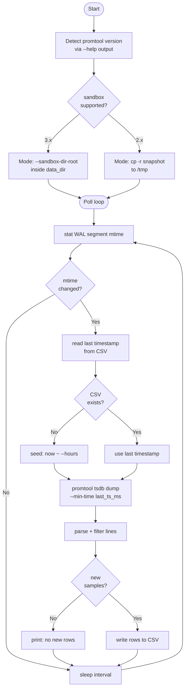

# promtool/ — TSDB direct read → CSV

Reads Prometheus TSDB blocks and WAL directly using the `promtool` binary
inside the container.  No HTTP API calls for data extraction — works even
when the query engine is overloaded or stopped.

Compatible with **Prometheus 2.x (tested 2.54) and 3.x**.

---

## Scripts

| Script | Output format | Best for |
|---|---|---|
| `watcher.py` | Wide — labels baked into column names | Debugging, Grafana-style view |
| `full_export.py` | Long — every label is its own column | ML model training |

Both scripts share the same architecture: WAL mtime change detection,
`docker exec promtool tsdb dump`, incremental export, include/exclude filters,
and sandbox auto-detection for promtool version compatibility.

---

## watcher.py

Live watcher that appends to CSV every time the WAL is updated (~15s).
Output is wide-format: one row per timestamp, one column per
(metric name + label set) combination.

```bash
python promtool/watcher.py                       # 15s poll, auto-named CSV
python promtool/watcher.py --interval 30         # 30s poll
python promtool/watcher.py --container my-prom   # custom container name
python promtool/watcher.py --out my_data.csv     # named output file
python promtool/watcher.py --hours 2             # seed first run with 2h history
python promtool/watcher.py --hours 336           # seed first run with 14 days
```

Output: `data/promtool_live_YYYYMMDD_HHMMSS.csv`

Wide format example:
```
timestamp            | upf_packets_count{dir=rx,iface=Access} | pfcp_sessions
2025-06-15 12:00:00Z | 42.0                                   | 50000.0
```

---

## full_export.py

Live watcher with the same WAL-triggered architecture as `watcher.py` but
writes long-format CSV where **every label is its own column**.
This is the format ML pipelines (sklearn, pandas, XGBoost) expect.

```bash
python promtool/full_export.py                        # 15s poll, auto-named CSV
python promtool/full_export.py --interval 30          # 30s poll
python promtool/full_export.py --container my-prom    # custom container name
python promtool/full_export.py --out train.csv        # named output file
python promtool/full_export.py --hours 336            # seed 14 days on first run

# Metric filtering
python promtool/full_export.py --include-prefix upf_ pfcp_
python promtool/full_export.py --exclude-prefix go_ process_ promhttp_
python promtool/full_export.py --include-contains session drop
python promtool/full_export.py --exclude-contains debug internal

# Drop constant labels that add no signal
python promtool/full_export.py --exclude-labels instance job
```

Output: `data/ml_export_YYYYMMDD_HHMMSS.csv`

Long format example:
```
timestamp_ms  | datetime_utc         | metric_name        | value | instance       | job | iface  | dir
1750000000000 | 2025-06-15T12:00:00Z | upf_packets_count  | 42.0  | localhost:8080 | upf | Access | rx
1750000000000 | 2025-06-15T12:00:00Z | pfcp_sessions      | 50000 | localhost:8080 | upf |        |
```

Missing labels for a given metric are written as empty strings.

### Schema stability

The CSV schema (column list) is discovered from the **first dump batch** and
then fixed for the session.  On restart, the schema is restored from the
existing CSV header — new rows are always compatible with the established file.
If a label key appears for the first time after the first dump, it is silently
ignored in that session (restart to pick it up).

---

## How WAL change detection works



Prometheus appends to the WAL every ~15 seconds.  A mtime change on the active
WAL segment file (`/prometheus/wal/<segment>`) triggers an incremental dump.
Only rows newer than the last exported timestamp are fetched — no duplicates
across restarts.

---

## Version compatibility

| Prometheus | Strategy |
|---|---|
| **3.x** | `promtool tsdb dump --sandbox-dir-root <data_dir>` — sandbox created inside the TSDB mount so hardlinks work across the same device |
| **2.x (e.g. 2.54)** | `cp -r /prometheus /tmp/prom_snap_<ts>` → dump from copy → `rm -rf` copy |

Auto-detected at startup by inspecting `promtool tsdb dump --help`.

The startup banner confirms which mode is active:
```
Sandbox    : yes (--sandbox-dir-root)          ← promtool 3.x
Sandbox    : no (promtool <3.x)                ← promtool 2.x
```

---

## Filter configuration

Both scripts share the same four filter constants at the top of each file.
They can also be overridden at runtime via CLI flags on `full_export.py`.

| Constant | CLI flag | Effect |
|---|---|---|
| `METRIC_PREFIXES` | `--include-prefix` | **Include** metrics whose name *starts with* any entry |
| `METRIC_CONTAINS` | `--include-contains` | **Include** metrics whose name *contains* any entry |
| `EXCLUDE_PREFIXES` | `--exclude-prefix` | **Exclude** metrics whose name *starts with* any entry |
| `EXCLUDE_CONTAINS` | `--exclude-contains` | **Exclude** metrics whose name *contains* any entry |

Include filters use **OR** logic — a metric passes if it matches `METRIC_PREFIXES` **or** `METRIC_CONTAINS`.
Both empty → all metrics pass.  Exclude filters are applied on top and always win.

`full_export.py` also supports `--exclude-labels` to drop specific label keys
from the CSV columns (e.g. `instance` and `job` when they are constant).
`watcher.py` has the equivalent `EXCLUDED_LABELS` set constant.

**Common filter patterns:**

```python
# Keep only UPF/PFCP metrics
METRIC_PREFIXES  = ("pfcp_", "upf_")

# Keep all metrics but strip Prometheus internal noise
EXCLUDE_PREFIXES = ("go_", "process_", "promhttp_", "scrape_")

# Keep any metric mentioning sessions or drops
METRIC_CONTAINS  = ("session", "drop", "throughput")

# Combine: keep pfcp_* or anything with "error", never debug metrics
METRIC_PREFIXES  = ("pfcp_",)
METRIC_CONTAINS  = ("error",)
EXCLUDE_CONTAINS = ("debug", "internal")
```

---

## promtool line format

```
{__name__="pfcp_sessions", instance="localhost:8080", job="upf"} 50000 1749453600000
 ──────────────── labels ─────────────────────────────────────── value  epoch_ms
```

`watcher.py` pivots this to a wide DataFrame.
`full_export.py` flattens each label into its own CSV column.
