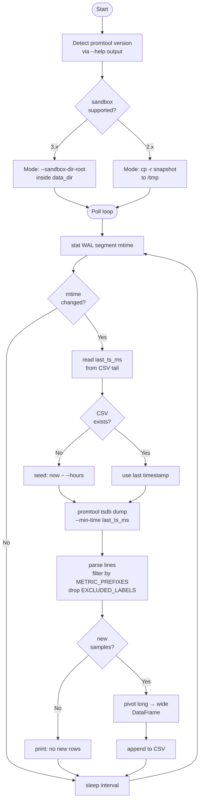

# promtool/ — TSDB direct read → CSV

Reads Prometheus TSDB blocks and WAL directly using the `promtool` binary
inside the container.  No HTTP API calls for data extraction.

Compatible with **Prometheus 2.x (tested 2.54) and 3.x**.

---

## Usage

```bash
python promtool/watcher.py                       # 15s poll, auto-named CSV
python promtool/watcher.py --interval 30         # 30s poll
python promtool/watcher.py --container my-prom   # if your container isn't "prom"
python promtool/watcher.py --out my_data.csv     # named output file
python promtool/watcher.py --hours 2             # seed first run with 2h history
```

Output: `data/promtool_live_YYYYMMDD_HHMMSS.csv`

The startup banner shows which mode is active:

```
Sandbox    : yes (--sandbox-dir-root)          ← promtool 3.x
Sandbox    : no (promtool <3.x, ...)           ← promtool 2.x
```

---

## Flow



---

## How change detection works

Prometheus writes new scrape data to its WAL (Write-Ahead Log) every ~15s.
The watcher polls the **mtime of the active WAL segment file**:

```
/prometheus/wal/00000000000000000001   ← Prometheus appends here
```

When mtime advances → new samples exist → run incremental dump.
Only rows newer than the last exported timestamp are fetched.

---

## Version compatibility

Replaying the live WAL in-place while Prometheus is writing to it can cause
torn reads and WAL errors.  The watcher handles this differently per version:

| Prometheus | Strategy |
|---|---|
| **3.x** | `promtool tsdb dump --sandbox-dir-root <data_dir>` — sandbox is created inside the TSDB mount so hardlinks work across the same device |
| **2.x (e.g. 2.54)** | `cp -r /prometheus /tmp/prom_snap_<ts>` → dump from copy → `rm -rf` copy |

The correct path is auto-detected at startup by inspecting `promtool tsdb dump --help`.
No manual configuration needed.

---

## Configuration

Edit the constants at the top of `watcher.py`:

| Constant | Type | Default | Effect |
|---|---|---|---|
| `PROM_CONTAINER` | `str` | `"upf-prom"` | Docker container name (`docker ps`) |
| `PROM_DATA_DIR` | `str` | `"/prometheus"` | TSDB path inside the container |
| `METRIC_PREFIXES` | `tuple[str, ...]` | `()` | **Include** metrics whose name *starts with* any entry — empty = no filter |
| `METRIC_CONTAINS` | `tuple[str, ...]` | `()` | **Include** metrics whose name *contains* any entry (substring) — empty = no filter |
| `EXCLUDE_PREFIXES` | `tuple[str, ...]` | `()` | **Exclude** metrics whose name *starts with* any entry — applied after include, takes precedence |
| `EXCLUDED_LABELS` | `set[str]` | `set()` | Label keys stripped from column names |

Include filters use **OR** logic — a metric passes if it matches `METRIC_PREFIXES` **or** `METRIC_CONTAINS`.  
If both are empty, all metrics pass.  `EXCLUDE_PREFIXES` is then applied on top and always wins.

**Filter examples:**
```python
# Keep only UPF/PFCP metrics
METRIC_PREFIXES  = ("pfcp_", "upf_")
METRIC_CONTAINS  = ()
EXCLUDE_PREFIXES = ()

# Keep any metric with "session" or "drop" anywhere in the name
METRIC_PREFIXES  = ()
METRIC_CONTAINS  = ("session", "drop", "throughput")
EXCLUDE_PREFIXES = ()

# Keep all UPF metrics but strip Prometheus internal go_/process_ noise
METRIC_PREFIXES  = ()
METRIC_CONTAINS  = ()
EXCLUDE_PREFIXES = ("go_", "process_", "promhttp_")

# Combine: keep pfcp_* OR anything with "error", but never scrape_ internals
METRIC_PREFIXES  = ("pfcp_",)
METRIC_CONTAINS  = ("error",)
EXCLUDE_PREFIXES = ("scrape_",)
```

**EXCLUDED_LABELS examples:**
```python
EXCLUDED_LABELS = set()                      # keep all label dimensions
EXCLUDED_LABELS = {"instance", "job"}        # drop constant labels → shorter column names
```

Dropping `instance` and `job` when they're the same for every metric keeps
column names short: `pfcp_sessions` instead of `pfcp_sessions{instance=localhost:8080_job=upf}`.

---

## promtool output format

```
{__name__="pfcp_sessions", instance="localhost:8080", job="upf"} 50000 1749453600000
 ──────────────── labels ─────────────────────────────────────── value  epoch_ms
```

`watcher.py` strips `instance` and `job` from labels, pivots the long-format
output to a wide DataFrame (one column per metric/label combination), and
appends to the CSV.

---

## vs promql/dump.py --watch

| | `promql/dump.py --watch` | `promtool/watcher.py` |
|---|---|---|
| Data path | HTTP → Prometheus engine | `docker exec` → TSDB blocks + WAL |
| Extra processes | None | None (uses container's promtool) |
| Works if HTTP is down | No | Yes |
| Latency | ~15s | ~15s |
| Histogram _bucket rows | Skipped | Skipped |
| Prometheus version | Any | 2.x and 3.x |
